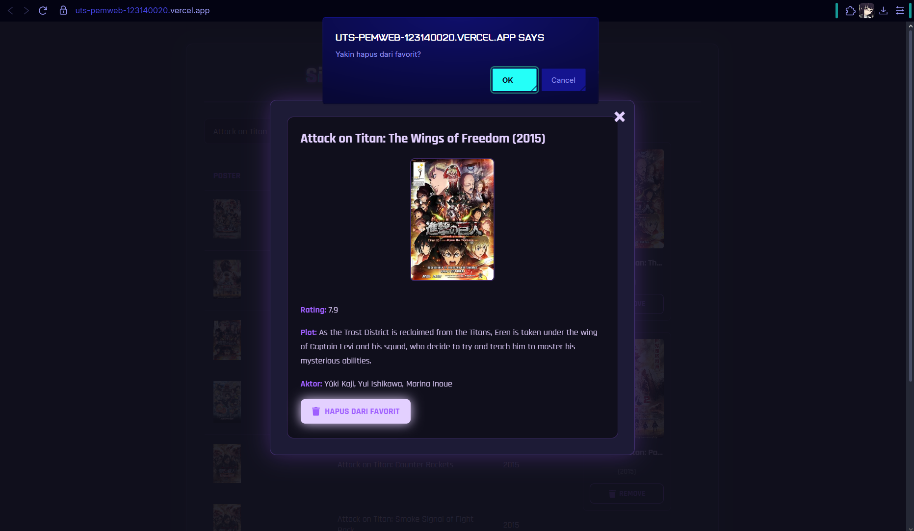
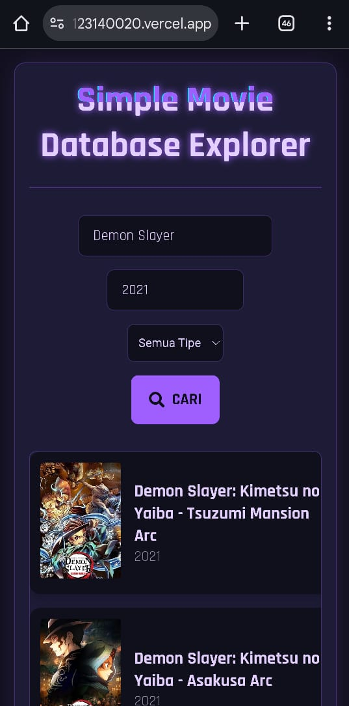
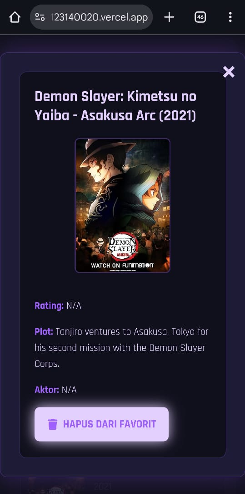

# UTS Pemrograman Web - Movie Database Explorer

Aplikasi React untuk mencari film menggunakan OMDb API.

**Nama:** Anselmus Herpin Hasugian
**NIM:** 123140020

## Link Deployment

Aplikasi dapat diakses di: [https://uts-pemweb-123140020.vercel.app]

## Fitur

* Pencarian film berdasarkan judul dan tahun.
* Menampilkan hasil dalam tabel yang responsif.
* Menampilkan detail film saat hasil diklik.
* Menambahkan dan menghapus film dari daftar favorit.
* Daftar favorit disimpan di `localStorage` (tidak hilang saat refresh).

## Cara Instalasi

1.  Clone repository: `git clone https://github.com/NAMA_ANDA/uts-pemweb-123140020.git`
2.  Masuk ke direktori: `cd uts-pemweb-123140020`
3.  Install dependencies: `npm install`
4.  Buat file `.env.local` di root folder.
5.  Isi file `.env.local` dengan API Key OMDb: `VITE_API_KEY=6908bd1f `
6.  Jalankan aplikasi: `npm run dev`

## Screenshot Aplikasi

### Screenshot Desktop
1. Halaman Utama Movie Database Exploler versi Desktop

2. Hasil Pencarian Film Attack on Titan dengan Tahun 2015

3. Detail Card / Modal Hasil Pencarian dan Tambah ke Favorit

4. Setelah di Tambahkan ke Favorit dan disimpan ke Localstorage 

5. Setelah di Tambahkan ke Favorit, Film dapat diremove dan ada Konfirmasi untuk Remove

6. Detail Card / Modal dapat dibuka dari Favoritelist dan dapat di Remove dari FavoriteList

### Screenshot Mobile
1. Halaman Utama Movie Database Exploler versi Mobile

2. Hasil Pencarian Demon Slayer dengan Tahun 2021

3. Detail Card / Modal Hasil Pencarian

4. Film ditambahkan ke Favorit dan disimpan ke Localstorage (Dapat di Remove)

5. Film yang telah ditambahkan ke Listfavorite dapat di Remove dan Harus dikonfirmasi Terlebih Dahulu

6. Film yang telah ditambahkan ke Listfavorite Berada dipaling Bawah untuk versi Mobile

7. Film dapat di Remove dari ListFavorite dan Harus dikonfirmasi Terlebih Dahulu
