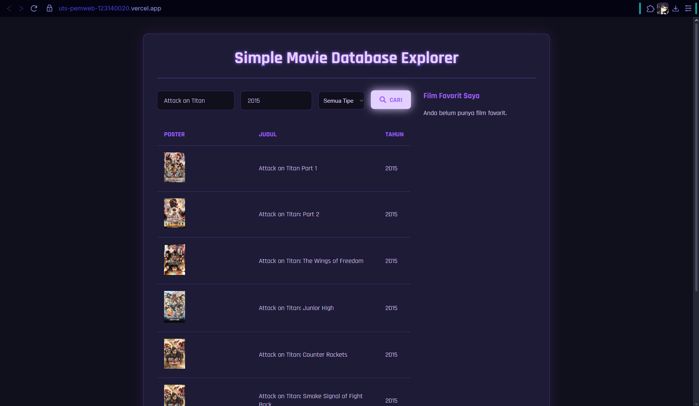
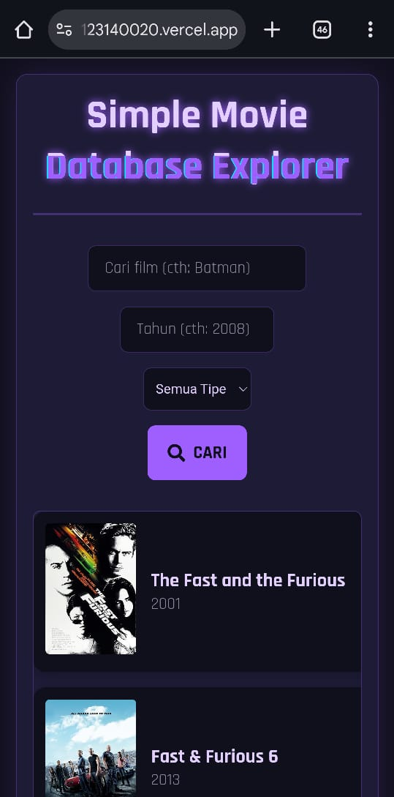
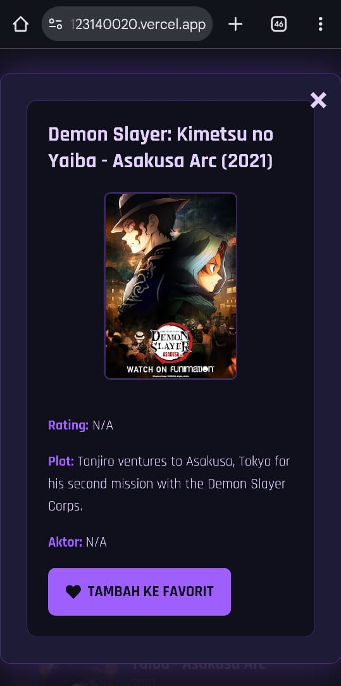

# UTS Pemrograman Web - Movie Database Explorer

Aplikasi React untuk mencari film menggunakan OMDb API.

**Nama:** Anselmus Herpin Hasugian
**NIM:** 123140020

## Link Deployment

Aplikasi dapat diakses di: [https://uts-pemweb-123140020.vercel.app]

## Fitur

* Pencarian film berdasarkan judul dan tahun.
* Menampilkan hasil dalam tabel yang responsif.
* Menampilkan detail film saat hasil diklik.
* Menambahkan dan menghapus film dari daftar favorit.
* Daftar favorit disimpan di `localStorage` (tidak hilang saat refresh).

## Cara Instalasi

1.  Clone repository: `git clone https://github.com/forkaton/uts-pemweb-123140020.git`
2.  Masuk ke direktori: `cd uts-pemweb-123140020`
3.  Install dependencies: `npm install`
4.  Buat file `.env.local` di root folder.
5.  Isi file `.env.local` dengan API Key OMDb: `VITE_API_KEY=6908bd1f `
6.  Jalankan aplikasi: `npm run dev`

## Screenshot Aplikasi

### Screenshot Desktop

**1. Halaman Utama Movie Database Explorer versi Desktop**

 

**2. Hasil Pencarian Film Attack on Titan dengan Tahun 2015**

 

**3. Detail Card / Modal Hasil Pencarian dan Tambah ke Favorit**

 

**4. Setelah di Tambahkan ke Favorit dan disimpan ke LocalStorage**

 

**5. Konfirmasi Remove Film dari Daftar Favorit**

 

**6. Detail Card / Modal dari FavoriteList dengan Opsi Remove**

 

### Screenshot Mobile

**1. Halaman Utama Movie Database Explorer versi Mobile**
 

  

**2. Hasil Pencarian Demon Slayer dengan Tahun 2021**
 

  

**3. Detail Card / Modal Hasil Pencarian**
 

  

**4. Film Ditambahkan ke Favorit dan Disimpan ke LocalStorage**
 

  

**5. Konfirmasi Remove Film dari Daftar Favorit**
 

  

**6. Daftar Film Favorit pada Versi Mobile**
 

  

**7. Konfirmasi Remove Film dari ListFavorite**
 

  