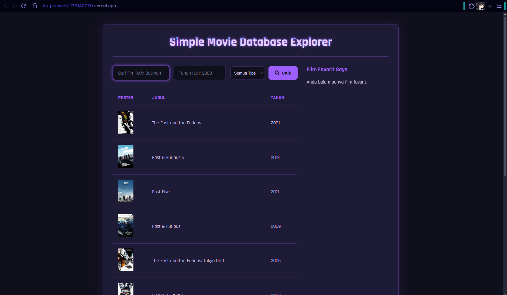
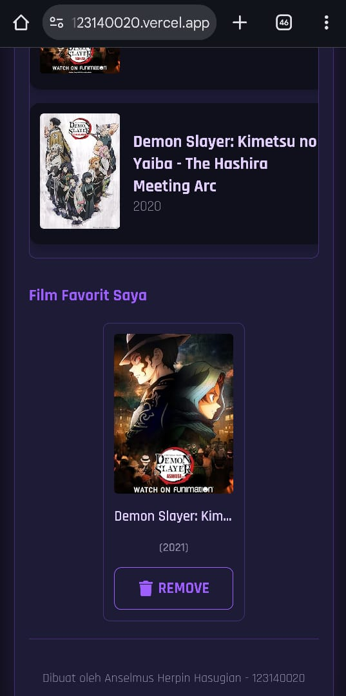

# UTS Pemrograman Web - Movie Database Explorer

Aplikasi React untuk mencari film menggunakan OMDb API, menampilkan detail, dan mengelola daftar favorit dengan tema "Neon Violet" kustom.

---

**Nama:** Anselmus Herpin Hasugian
**NIM:** 123140020

---

## Link Deployment

Aplikasi dapat diakses di: [https://uts-pemweb-123140020.vercel.app](https://uts-pemweb-123140020.vercel.app)

---

## Fitur

* Pencarian film berdasarkan judul, tahun, dan tipe (Movie, Series, Episode).
* Menampilkan hasil dalam tabel desktop atau daftar kartu responsif di mobile.
* Peningkatan UI/UX: *Skeleton loader* saat mencari dan *placeholder* ikon untuk poster yang hilang.
* Menampilkan detail film (plot, rating, aktor) dalam **Modal (pop-up)** saat hasil diklik.
* Daftar favorit di *sidebar* (desktop) yang juga bisa diklik untuk melihat detail.
* Tombol favorit yang **dinamis** (otomatis berubah antara "Tambah" dan "Hapus").
* **Konfirmasi** sebelum menghapus film dari favorit.
* Daftar favorit disimpan secara persisten di `localStorage`.

---

## Cara Instalasi dan Menjalankan

1.  **Clone repository:**
    ```bash
    git clone https://github.com/forkaton/uts-pemweb-123140020.git
    ```
2.  **Masuk ke direktori:**
    ```bash
    cd uts-pemweb-123140020
    ```
3.  **Install dependencies:**
    ```bash
    npm install
    ```
4.  **Dapatkan API Key OMDb:**
    * Kunjungi [**website OMDb API**](https://www.omdbapi.com/apikey.aspx)
    * Pilih opsi "FREE" dan daftarkan email Anda.
    * Cek email Anda (termasuk folder Spam) untuk mendapatkan API Key unik Anda.

5.  **Buat file Environment:**
    * Buat file bernama `.env.local` di folder utama proyek (sejajar dengan `package.json`).

6.  **Isi file `.env.local`:**
    * Isi file tersebut dengan API Key yang baru Anda dapatkan. (Ganti `KEYOMDb` dengan key yang Anda peroleh sebelumnya).
    ```
    VITE_API_KEY=KEYOMDb
    ```
7.  **Jalankan aplikasi (mode development):**
    ```bash
    npm run dev
    ```
    Aplikasi akan berjalan di `http://localhost:5173/` (atau port lain jika 5173 terpakai).

---

## Screenshot Aplikasi

### Screenshot Desktop

**1. Halaman Utama (Hasil Pencarian Default & Layout 2 Kolom)**

<br>

**2. Hasil Pencarian Kustom (Attack on Titan, 2015)**

<br>

**3. Detail Card / Modal (Hasil Klik Pencarian)**

<br>

**4. Film Ditambahkan ke Favorit (Sidebar Ter-update)**

<br>

**5. Konfirmasi Hapus dari Daftar Favorit (Sidebar)**

<br>

**6. Detail Card dari Favorit (Tombol Dinamis "Hapus")**

<br>

---

### Screenshot Mobile

**1. Halaman Utama (Layout Tumpuk)**
<br>

<br><br>

**2. Hasil Pencarian (Layout Kartu Responsif)**
<br>

<br><br>

**3. Detail Card / Modal (Responsif)**
<br>

<br><br>

**4. Film Ditambahkan ke Favorit (Modal & Latar)**
<br>

<br><br>

**5. Konfirmasi Hapus dari Modal**
<br>

<br><br>

**6. Daftar Favorit (Grid Responsif)**
<br>

<br><br>

**7. Konfirmasi Hapus dari Kartu Favorit**
<br>

<br><br>

---

## Screenshot Console Bebas Error ataupun Issues

